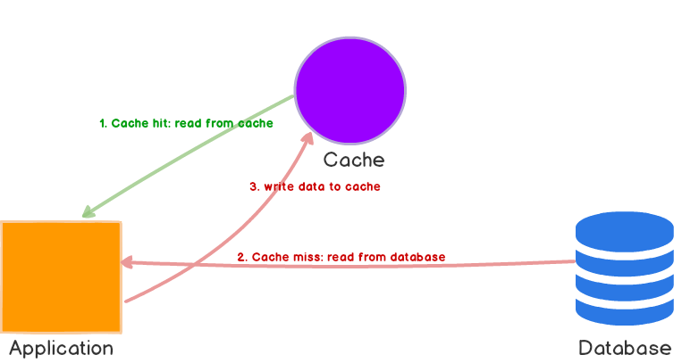

# Redis Wrapper

A wrapper use redis to cache query mongodb.

## Disclamer

This document is writed base on [Amazon ElastiCache for Redis Guild](https://docs.aws.amazon.com/AmazonElastiCache/latest/red-ug/Strategies.html) and this article [Caching Strategies and How to Choose the Right One](https://codeahoy.com/2017/08/11/caching-strategies-and-how-to-choose-the-right-one/)

## Dependencies

This module require these packages **redis**, **mongodb**, **bluebird**.

Suppose all code in this docs run asynchronous

## Lazy loading

I. How it work

Lazy loading is a caching strategy that loads data into the cache only when necessary.

Whenever your application requests data, it first makes the request to the LazyWrapper cache. If the data exists in the cache and is current, LazyWrapper returns the data to your application. If the data does not exist in the cache, or the data in the cache has expired, your application requests the data from your data store which returns the data to your application. Your application then writes the data received from the store to the cache so it can be more quickly retrieved next time it is requested.
That data will be deleted after period called expire.Have two cases can happen:

1. Cache hit: When data is in the cache and isn't expired

   Cache return data directly to user.

2. Cache miss: When data isn’t in the cache or is expired

   Query excute on main database (mongo). Then, data saved into cache and return to user.

The first query allways miss so if
See below picture for more information



II. How to use

1. Create LazyWrapper client

```language-javascript
const LazyWrapper = require('./index').LazyWrapper;
const MongoClient = require('mongodb').MongoClient;
const RedisClient = require('redis).RedisClient;

// Connection URL
const url = 'mongodb://localhost:27017';

// Database & Collection Name
const dbName = 'cache_db';
const collName = 'cache_coll';

// Expire time
const expire = 120;

// Connect to the server
const mongoClient = await createMongoClient(url);
const db = client.db(dbName);
const coll = db.collection(collName);
const redisClient = new RedisClient();

// Create wrapper for lazy cache
const lazyWrapper = new LazyWrapper(coll, redisClient, expire);
```

2. Finding

LazyWrapper supports find and findOne function. Demo for find, the usage is same for findOne.

Find all document

```language-javascript
const docs = await lazyClient.find();
```

Find Documents with a Query Filter

```language-javascript
const query = {
    $and: [
        { $or: [{ height: 0.99 }, { weight: 1.99 }] },
        { $or: [{ name: 'William' }, { weight: { $lt: 20 } }] }
    ]
}

const docs = await lazyClient.find(query);
```

## Inline cache ()
